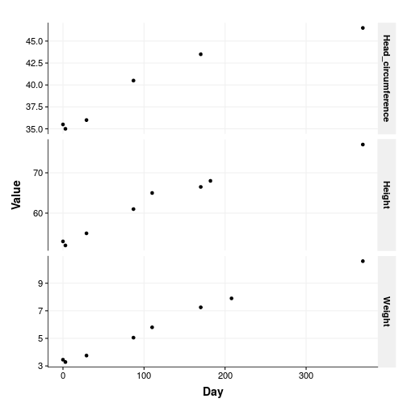
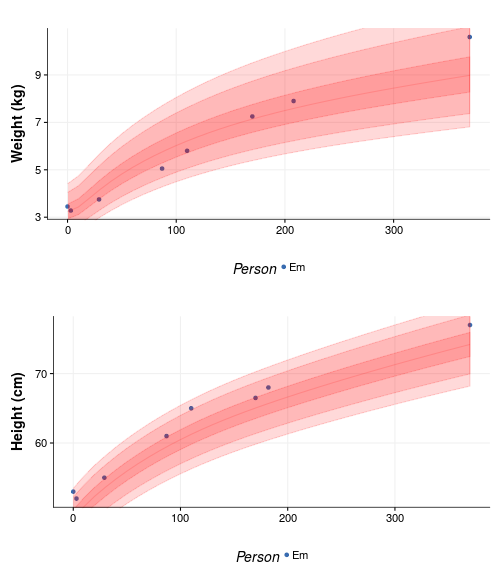

## The goal

So I am a bit of a nerd and also a recent progenitor. So of course I had to find ways of analyzing the growth of my F1. What follows is a very brief look into the growth pattern of `Em`, using the little data I have so far - F1 is only 7 months old. 


## The data

Initially the data was input manually, in wide format, and then convert to tidier long format, but in the end I decided to write it in a file, already in long format, because it is easier to read and update. It also makes more sense that ways because there aren't values for every time point for every variable. For instance, the circumference of the head is only measured when `Em` visits the Doctor. Nevertheless I am leaving the original code here for reference.

Another thing to keep in mind is that both the days and the measurements are estimates - some were taken at home using a bathroom scale or in changing station with a ruler. I expect that over time the will be ironed out. Also, this is just a bit of fun. 


```r
em <- data.frame(
  # code = factor(c("U1", "U2", "U3", "U4", "U5")),
  Week = c(0, 1, 4, 16, 28),
  Weight = c(3.450, 3.280, 3.750, 5.050, 7.250),
  Height =c(53, 52, 55, 61, 66.5),
  Head_circumference = c(35.5, 35, 36, 40.5, 43.5)
)
em

em_tidy <- em %>%
  mutate(Day = Week * 7) %>% 
  select(-c(Week)) %>%
  gather(Measurement, Value, c( Weight, Height, Head_circumference)) %>%
  mutate(Person = "Em")

colnames(em_tidy) <- c("Week", "Value", "Measurement")
```

The units are not in the table but are `cm` for height and head circumference, and `kg` for weight.


```r
em_tidy <- read.delim("data/em_data.txt.csv")
glimpse(em_tidy)
```

```
## Observations: 18
## Variables: 4
## $ Person      <fctr> Em, Em, Em, Em, Em, Em, Em, Em, Em, Em, Em, Em, E...
## $ Day         <int> 0, 0, 0, 7, 7, 7, 28, 28, 28, 112, 112, 112, 168, ...
## $ Measurement <fctr> Weight, Height, Head_circumference, Weight, Heigh...
## $ Value       <dbl> 3.45, 53.00, 35.50, 3.28, 52.00, 35.00, 3.75, 55.0...
```

## Exploratory plot

The first thing to do is to plot all the things!


```r
ggplot(em_tidy, aes(x=Day, y=Value)) +
  geom_point() + 
  facet_grid(Measurement ~ ., scales = "free_y") +
  theme_Publication() +
  scale_colour_Publication()
```



Well, `Em` is growing so that is nice. The plot is a bit clunky though: there are no units and ti is not easy to read. ONe of those situations when `facets` ate not ideal. Let's change that.


```r
p1 <- ggplot(subset(em_tidy, Measurement == "Weight"), aes(x=Day, y=Value)) +
  geom_point() +
  theme_Publication() +
  scale_colour_Publication() +
  xlab("") +
  ylab("Weight (kg)") 

p2 <- ggplot(subset(em_tidy, Measurement == "Height"), aes(x=Day, y=Value)) +
  geom_point() +
  theme_Publication() +
  scale_colour_Publication() +
  xlab("") +
  ylab("Height (cm)") 

p3 <- ggplot(subset(em_tidy, Measurement == "Head_circumference"), aes(x=Day, y=Value)) +
  geom_point() +
  theme_Publication() +
  scale_colour_Publication() +
  xlab("Age since birth (Days)") +
  ylab("Head circumference (cm)") 

multiplot(plotlist=list(p1, p2, p3))
```


So yes, there is some growing happening but also a dip around the first week when `Em` lost nearly 200 g. Turns out this is completely [normal](http://www.nhs.uk/Conditions/pregnancy-and-baby/Pages/baby-weight-and-height.aspx) and as expected at the next visit the weight was beck up again.

Looking at her numbers alone feel a little bland, and as I keep hearing in [more or less](http://www.bbc.co.uk/programmes/b006qshd) to understand how big a number really is, one needs to compare it to something.  


## General Population data

Enter the data for the general population. This data as been compiled by the World Health organization for quite some time now, and serves as basis for pediatricians around the world, to compare baby growth to what is expected. Luckily for me all of this data has been assembled in a neat package: The healthy growth [package](https://github.com/hafen/hbgd). Check also the [tutorial](https://hbgdki.github.io/hbgd/).


```r
options(repos = c(
  CRAN = "http://cran.rstudio.com/",
  deltarho = "http://packages.deltarho.org"))
install.packages("hbgd")
```

It not only contains data, but also some practical functions (and visualizations) to extract said data. For instance one can get the median height of Female babies (the default) for any range of ages, let's say for the first year: 


```r
library("hbgd")
```

```
## Loading required package: datadr
```

```
## Loading required package: trelliscope
```

```r
x <- seq(0, 365, by = 7)
x
```

```
##  [1]   0   7  14  21  28  35  42  49  56  63  70  77  84  91  98 105 112
## [18] 119 126 133 140 147 154 161 168 175 182 189 196 203 210 217 224 231
## [35] 238 245 252 259 266 273 280 287 294 301 308 315 322 329 336 343 350
## [52] 357 364
```

```r
med <- who_centile2htcm(x)
med
```

```
##  [1] 49.1477 50.3298 51.5120 52.4695 53.3809 54.2454 55.0642 55.8406
##  [9] 56.5767 57.2761 57.9436 58.5816 59.1922 59.7773 60.3393 60.8795
## [17] 61.3991 61.8988 62.3795 62.8423 63.2884 63.7196 64.1370 64.5422
## [25] 64.9366 65.3214 65.6978 66.0668 66.4290 66.7850 67.1355 67.4810
## [33] 67.8219 68.1585 68.4911 68.8200 69.1452 69.4672 69.7858 70.1015
## [41] 70.4142 70.7241 71.0314 71.3359 71.6378 71.9372 72.2340 72.5284
## [49] 72.8203 73.1099 73.3971 73.6820 73.9647
```

With this I can now compare my offspring with what is expected  in the population:


```r
age <- unique(em_tidy$Day)

per_who <- data.frame(
    Day = age,
    Weight = who_centile2wtkg(age),
    Height = who_centile2htcm(age),
    Head_circumference = who_centile2hcircm(age)
  ) %>%
  gather(
    Measurement,
    Value,
    c( Weight, Height, Head_circumference)) %>%
  mutate(Person = "WHO") %>%
  rbind(em_tidy)

glimpse(per_who)
```

```
## Observations: 39
## Variables: 4
## $ Day         <int> 0, 7, 28, 112, 168, 182, 110, 0, 7, 28, 112, 168, ...
## $ Measurement <chr> "Weight", "Weight", "Weight", "Weight", "Weight", ...
## $ Value       <dbl> 3.2322, 3.3388, 4.0987, 6.2511, 7.1133, 7.2894, 6....
## $ Person      <chr> "WHO", "WHO", "WHO", "WHO", "WHO", "WHO", "WHO", "...
```


```r
p1 <- ggplot(subset(per_who, Measurement == "Weight"), aes(x=Day, y=Value, color=Person)) +
  geom_point(group="Person") +
  geom_line() +
  theme_Publication() +
  scale_colour_Publication() +
  xlab("") +
  ylab("Weight (kg)") 

p2 <- ggplot(subset(per_who, Measurement == "Height"), aes(x=Day, y=Value, color=Person)) +
  geom_point(group="Person") +
  geom_line() +
  theme_Publication() +
  scale_colour_Publication() +
  xlab("") +
  ylab("Height (cm)") 

p3 <- ggplot(subset(per_who, Measurement == "Head_circumference"), aes(x=Day, y=Value, color=Person)) +
  geom_point(group="Person") +
  geom_line() +
  theme_Publication() +
  scale_colour_Publication() +
  xlab("Age since birth (Days)") +
  ylab("Head circumference (cm)") 

multiplot(plotlist=list(p1, p2, p3))
```


Yeah, we really screwed up with that one measurement. On the other hand, `Em` appears to be has average as an F1 can get. But we can test that as well. Suppose we want to know the WHO centile of a female child at `Em` age (182) who is 68 cm tall:


```r
current_age <- max(em_tidy$Day)
current_weight <- max(subset(em_tidy, Measurement == "Weight")$Value)
weight_age <- max(subset(em_tidy, Measurement == "Weight")$Day)
current_height <- max(subset(em_tidy, Measurement == "Height")$Value)
height_age <- max(subset(em_tidy, Measurement == "Height")$Day)

per_h <- who_htcm2centile(agedays = height_age, htcm = current_height)
per_w <- who_wtkg2centile(agedays = weight_age, wtkg = current_weight)
```

It seems like she is in the 84.5258419 percentile for height and in the 56.1802652 percentile for weight, which makes sense - Slender was the word used by the doctor to describe `Em`.

We can also see that in when plotting the percentile bands, again using the nifty function of `hbgd`, to visualize this:

>  WHO bands at centiles 1, 5, 25, 50, 75, 95, 99


```r
p1 <- ggplot(subset(em_tidy, Measurement == "Weight"), aes(x=Day, y=Value, color=Person)) +
  geom_point(group="Person") +
  xlim(0, current_age) +
  geom_who(x_seq = seq(0, (current_age) , by = 10), y_var = "wtkg") +
  theme_Publication() + 
  scale_colour_Publication() +
  xlab("") +
  ylab("Weight (kg)") 

p2 <- ggplot(subset(em_tidy, Measurement == "Height"), aes(x=Day, y=Value, color=Person)) +
  geom_point(group="Person") +
  geom_who(x_seq = seq(0, (current_age) , by = 10), y_var = "htcm") +
  theme_Publication() + 
  scale_colour_Publication() +
  xlab("") +
  ylab("Height (cm)") 

multiplot(plotlist=list(p1, p2))
```



Take home messages: 
- F1 is very average
- F0 is pretty poor at taking measurements
